<!-- ═══════════════════════════════════════════════════════════════════════
     🌌  SPACE-THEMED PROFILE — all animated art lives in assets/ as
         hand-built SVGs (SMIL animations run inside GitHub's image proxy).
         assets/mission-control.svg auto-refreshes daily via
         .github/workflows/update-dashboard.yml — edit the .template.svg,
         never the generated file.
     ═══════════════════════════════════════════════════════════════════════ -->

  

  

 

  

## 🛰️ Mission Log — About Me

- 🪐 **Full-stack developer** orbiting around **Laravel, Java, React & Golang**
- ☄️ Passionate about building **scalable, efficient & high-performance** applications
- 🌌 Love solving problems and continuously exploring **new technologies**
- 🔭 Currently charting new territories in **backend architecture & distributed systems**
- 📡 Transmission channels always open for **collaborations & wild ideas**
- 🛸 Fun fact: my code compiles at the speed of light *(most days)*

 

## 🚀 Rocket Fuel — Tech Stack

  

## 📡 Mission Control — GitHub Stats

  

 

  

 

  

## 🐍 Cosmic Serpent — Contribution Orbit

  <picture>
    <source media="(prefers-color-scheme: dark)" srcset="https://raw.githubusercontent.com/rohit123-rawat/rohit123-rawat/output/github-snake-dark.svg" />
    <source media="(prefers-color-scheme: light)" srcset="https://raw.githubusercontent.com/rohit123-rawat/rohit123-rawat/output/github-snake.svg" />
    
  </picture>

## 📬 Establish Contact — Transmission Channels

  &nbsp;
  &nbsp;
  

 

  💫 *"Code is like humor. When you have to explain it, it's bad."* — Cory House

  🌠 *Let's build something out of this world together!*

 

  

